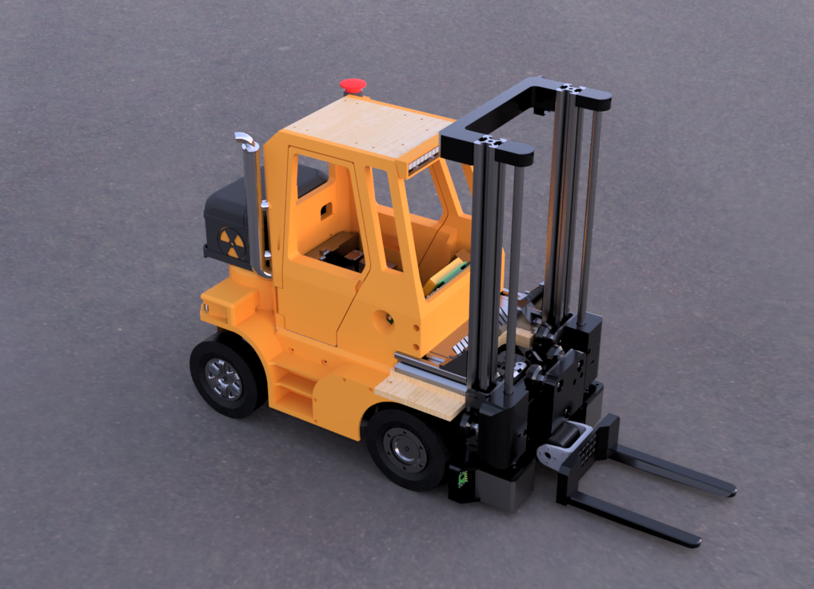

# Chariot élévateur
Code du robot de GobGob Senpaï pour Eurobot 2019

## Code bas niveau (`low_level/`)

Programme en charge des tâches dites "bas niveau", directement liées au matériel et effectuées en temps réel.  
Notamment :
* L'odométrie
* L'asservissement en vitesse, en position et en trajectoire
* La lecture des données des capteurs
* Le contrôle des servomoteurs
* Le contrôle des moteurs pas à pas
* L'affichage du score
* Le contrôle de l'éclairage
* Le contrôle du fumigène

### Chaine de compilation
Il s'agit d'un projet Arduino classique, compilé pour la plateforme `Teensy 3.5`

* Installer l'IDE Arduino (v1.8.8) : https://www.arduino.cc/en/Main/Software
* Installer Teensyduino (v1.45) : https://www.pjrc.com/teensy/td_download.html
* Installer les bibliothèques nécessaires (liste complète ci-dessous)

> Type de carte: "Teensy 3.5"  
> USB Type: "Serial"  
> CPU Speed: "120MHz"  
> Optimize: "Faster"  

### Dépendances
#### Bibliothèques standard
Bibliothèques directement incluses avec l'IDE Arduino et Teensyduino, ou bien pouvant se télécharger via le gestionnaire de bibliothèques de l'IDE Arduino.
>* Ethernet (v2.0.0) : https://github.com/PaulStoffregen/Ethernet
>* Adafruit NeoPixel (v1.1.3) : https://github.com/adafruit/Adafruit_NeoPixel
>* Adafruit LED Backpack Library (v1.1.6) : https://github.com/adafruit/Adafruit-LED-Backpack-Library
>* StepperDriver (v1.1.4) : https://github.com/laurb9/StepperDriver

#### Bibliothèques tierces
Bibliothèques à installer manuellement (coiper le dossier de la librairie directement dans le répertoire `Arduino/librairies/`).
>* dynamixel_teensy (v1.0) : https://github.com/sylvaing19/dynamixel_teensy
>* ToF Sensor (v1.0) : -

## Code haut niveau (`high_level/`)

Programme en charge des tâches dites "haut niveau" qui nécessitent une puissance de calcul plus importante:

* Recherche de trajectoire
* Traitement haut niveau des capteurs
* Mémorisation de l'état du robot, des éléments de jeu et des obstacles vus
* Scripts, enchaînements d'actions écrits à l'avance

### Dépendances

Les dépendances du haut niveau ont toutes été développées en interne.

Injection de dépendances : https://github.com/PFGimenez/dependency-injector

Gestion de configuration : https://github.com/PFGimenez/config

Log : https://github.com/PFGimenez/log

Outils graphiques : https://github.com/PFGimenez/graphic-toolbox

Kraken, recherche de chemin courbe : https://github.com/PFGimenez/The-Kraken-Pathfinding

### Chaîne de compilation

Il s'agit d'un projet maven Java. Un JDK ainsi que maven sont nécessaires. Pour compiler le haut niveau, il suffit de se placer dans le répertoire `high_level` :

    cd high_level

Et de compiler grâce à maven:

    mvn clean compile assembly:single

Le fichier généré est `chariot-hl.jar` placé dans `high_level/target`. Des scripts placés dans `high_level` permet de l'utiliser facilement.
